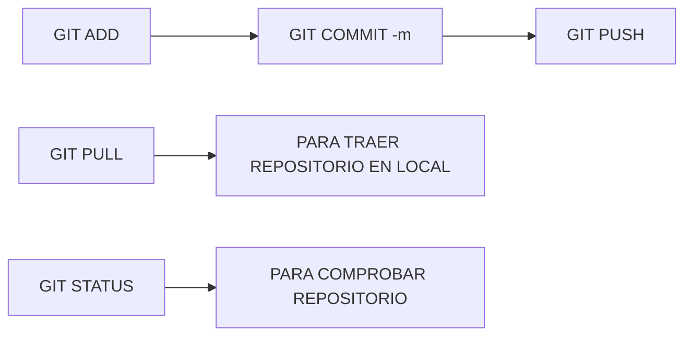

# APUNTES DIA : 2 - MARTES

## Markdown, Notable e instalar Java y VSC

- Instalar java:
1. Ir a https://www.oracle.com/es/java/technologies/downloads/
2. Descargar JDK en version LTS, en este caso tenemos la version 21, bajamos el instalador necesario en este caso windwos MSI intaller e instalamos.
3. Descargamos Visual Studio Code en https://code.visualstudio.com/download
4. Instalar JDK, configurar **variables de entorno de Java**
  - Ejecutamos terminal de windows.
  - SystempropertiesAdvanced
  - Configuración avanzada del sistema > Variables de entorno.
  - En variables del sistema, buscamos PATH y doble click y se abre una ventana con las variables de entorno del sistema operativo > Nuevo y creamos una con la direccion local de java que seria **C:\Program Files\Java\jdk-21**
  - *(Opcional) puedes comprobar si se ha realizado correctamente la instalacion de la variable de enterono ejecutando en consola java --version y con comando javac --verion y si sale la version de java instalada sin error esta todo ok*

---

- Instalamos Visual Studio Code y configuramos:
  - Ya se crea la variable de entorno si esta marcado en el instalador.
  - Intalar extensiones:
    - Spanish Language Pack.
    - Extension Pack for Java.
    - Extensión Markdown
    - Markdown all in one

*Lo bueno de Java es que puede funcionar en cualquier maquina independientemente del sistema operativo que tenga.*

---

### Repaso Git Hub:
- git status para saber como esta el repositorio, si hay algo nuevo o no sincronizado o pendiente de comitear.
- git add . para subir todod al repositorio local.
- git commit -m "mensaje con informacion de comit"
- git push, solo si estamos seguros de estar todo bien porque esto sube a la nube. :+1:
- git pull, para bajar repositorio a mi repositorio local.
- Podemos consutar historial de versiones de nuestro repositorio.
- git clone para bajar reposotorio de la nuebe la primera vez, desde la web en el boton "code" podemos copiar el url y en consola hacemos el clon con esa direccion URL. 

---

Para añadir personas colaboradoras al proyecto de Git Hub:
- Entramos en el repositorio por la web.
- En settings > Collaborators > Add people.
- Al destinatario le llegara una invitacion que debera aceptar y poder colaborar con el proyecto.

---

### Probando Mermaid y plugin para Visual Studio Code

---

Comandos adicionales menos usados pero importantes:
- git remote, repositorios remotos
- git remote add, añadre repo remoto
- git fetch descarga cambios sin fusionar
- git merge, fusiona los cambios

---

## Ramas git:

- Las ramas son necesarias cuando hay varias personas trabajando, se empieza siempre por una rama Master o Main.
- En la practica se suele tener varios ramas, una para desarrollo o development y a su vez se crean ramas para implantar mejoras o features.
- git chetout "rama" para cambiar de una rama a otra.
- git merge "rama" fusiona ramas. Es recomendable por ejemplo para fusionar rama feature-y a develop hacer estos pasos:
  - git status
  - git checkout "rama develop" - para crear una rama
  - git merge feature-y
  - git commit -m "fusion"

---

## Roles proyetos :
#### Junior menos de 2 años
- Junior FrontEnd: entre 25 y 30 mil euros año. 
- Junior BackEnd: entre 20 y 25 mil euros año.
- Junio FullStack: entre 28 y 32 mil euros años.

#### Senior mas de 2 años
- Senior FrontEnd: entre 30 y 35 mil euros año. 
- Senior BackEnd: entre 25 y 30 mil euros año.
- Senior FullStack: entre 32 y 35 mil euros años.

#### Analista
- Sumaran 5 mil.
#### Consutor
- Sumar 5 o 8 mil mas.

---

# APUNTES DIA 3 - MIERCOLES

## Practicamos Ramas:

Hacemos ejercicio con un repositorio para simular trabajo de la clase donde cada uno o por equipos una tarea y creamos un repositorio Practicas Equipos y creamos una rama feature/juanma

---
**mira repo de apuntes de compañesros de trabajo equipo**
## Virtualización:

# 🖥️ Virtualización y Emulación de Sistemas

## 📘 ¿Qué es la Virtualización?

La **virtualización** es una técnica que permite ejecutar varios sistemas operativos de forma simultánea en una sola máquina física, utilizando software llamado **hipervisor**.

- 🧠 El sistema operativo "invitado" corre dentro de una **máquina virtual (VM)**.
- 🧩 Comparte recursos del hardware real, como CPU, RAM y disco.
- 🧱 Se usa para pruebas, entornos de desarrollo, servidores y más.

### Tipos de Virtualización:
- 🖥️ **Virtualización completa**: el sistema invitado no sabe que está virtualizado.
- 🧬 **Paravirtualización**: el sistema invitado está modificado para ser más eficiente dentro del entorno virtual.

---

## 🎮 ¿Qué es la Emulación?

La **emulación** simula por software un sistema completamente diferente al hardware real. Permite ejecutar sistemas diseñados para otra arquitectura.

- 🕹️ Ejemplo: correr un sistema de Nintendo en PC.
- 🐢 Suele ser más lenta que la virtualización.
- 🧪 Útil para probar software antiguo o de otra plataforma.

---

## 📦 Uso de VirtualBox

**VirtualBox** es un software gratuito de Oracle que permite crear y administrar máquinas virtuales.

### ✅ Instalación de VirtualBox en Windows/Linux/Mac:

1. 🧭 Ve a la web oficial: [https://www.virtualbox.org/](https://www.virtualbox.org/)
2. 🔽 Descarga la versión adecuada para tu sistema.
3. 🧰 Instala siguiendo el asistente.
4. (Opcional) Instala el **Extension Pack** para funciones extra como USB 2.0/3.0, RDP, etc.

---

## 🛠️ Crear una Máquina Virtual en VirtualBox

1. 📁 Abre VirtualBox y haz clic en **"Nueva"**.
2. 🏷️ Asigna un nombre, tipo de sistema y versión (por ejemplo, Ubuntu 64-bit).

---

Hacemos test, y apuntate que el jueves 3 de Junio es examen tipo test.

---

** Markdown: Indices y convertir a pdf con Visual Studio Code
** Bajamos extension para Visual Studio Markdown all in one

Hola hola indices y pies de pagina [^1]

### F1 y le damos crear tabla de contenido

[^1]:esto es el objetivo

### Incisos Opos:
#### Hay plaza de A2 C1 que requieren carrera pero con promocion interna puedes hacer la prueba una vez dentro.

***https://www.rptage.com/pf/funcionarios.php para ver plazas vacantes en el ayuntamiento o municipio que estes buscando.

### Secciones en Html ayudan a organizar y dividir la pagina:

  1. #### se suele usar los h1, ...h6.
  2. #### tam

---

